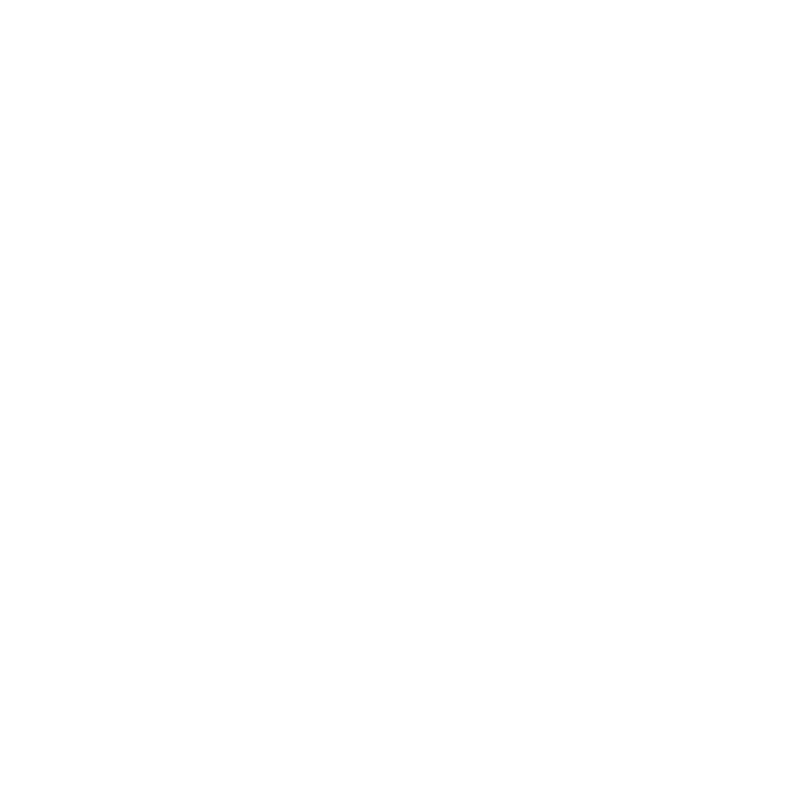

<div align="center">
  
  &nbsp;&nbsp;&nbsp;&nbsp;&nbsp;&nbsp;
  
</div>

# ISLES'26 — submission container

Source code for the Grand Challenge algorithm `BRE SEG`, submitted to the
[ISLES'26 challenge](https://isles-26.grand-challenge.org/) by team STRATIF-AI-BRE.

The algorithm was developed by the Brest team at the Centre Hospitalier Régional
et Universitaire (CHRU) de Brest, one of the partner institutions of the
[STRATIF-AI](https://stratif-ai.eu/) consortium, which brings together fifteen
research groups, universities and hospitals across Europe.

This repository contains everything needed to rebuild the submitted container image
and run it on a T1-weighted MRI volume. Model weights are downloaded separately, see step 2.

---

## Requirements

- Docker, or Podman with `--format docker-archive` support. The submitted image was built
  with Podman 5.8.2; the `Dockerfile` is standard and builds identically under Docker.
- NVIDIA GPU, 16 GB VRAM (the submitted container ran on a T4)
- ~30 GB free disk: the built image is 4.1 GB compressed, and the CUDA base layers expand to
  roughly 10 GB during the build
- 1.2 GB for the weights archive

CPU-only execution works but is slow: the ensemble performs 24 forward passes per case.

---

## 1. Build the image

```bash
git clone <THIS REPO>
cd <REPO>

docker build --platform=linux/amd64 --tag isles26-submission .
```

Podman, which is what the submitted image was built with:

```bash
./do_build_podman.sh
```

`--platform=linux/amd64` is required. An arm64 image fails at runtime on Grand Challenge and
on most Linux hosts.

Two Podman specifics, handled by the scripts:

- The base image is fully qualified as `docker.io/pytorch/pytorch:...`. Podman assumes no
  default registry and prompts interactively for an unqualified name, which blocks any
  non-interactive build.
- GPU access goes through CDI (`--device nvidia.com/gpu=all`), not `--gpus all`. Generate the
  specification once with `nvidia-ctk cdi generate --output=/etc/cdi/nvidia.yaml`.

The build installs `nnunet_trainer_isles26.py` and `nnunet_normalization.py` **into the
`nnunetv2` package tree**, not just onto the `PYTHONPATH`. nnU-Net resolves the trainer named
in the checkpoint and the normalisation named in `plans.json` by scanning its own package, so
this step is mandatory. The build fails if the trainer cannot be resolved afterwards.

Verify:

```bash
docker inspect --format '{{index .Config.Labels "org.grand-challenge.api-method"}}' isles26-submission
# invoke

docker run --rm --entrypoint python isles26-submission -c "import torch; print(torch.version.cuda)"
# 12.6
```

---

## 2. Download the weights

**Link:** `https://drive.google.com/file/d/1pSfnqBmiTQp1CA5FxOoPAz52tGuObpca/view?usp=sharing`
**File:** `model.zip` (1.14 GB)
**SHA-256:** `d2698ff480a46f34f28b0a3bc759c123284288f330a95df5c4361b99f694a223`

```bash
sha256sum model.zip             # compare with the value above
unzip model.zip -d model
find model -type f | sort
```

If the archive expands to `model/model/nnunet/...`, it was zipped one level too high. Move the
inner directory up: the `nnunet` folder must sit directly under `model/`.

Expected:

```
model/nnunet/Dataset502_ISLES26_rawB/nnUNetTrainerISLES26A_500epochs__nnUNetResEncUNetLPlans__3d_fullres/
├── dataset.json
├── plans.json
├── crossval_results_folds_0_1_2/postprocessing.pkl
├── fold_0/checkpoint_final.pth
├── fold_1/checkpoint_final.pth
└── fold_2/checkpoint_final.pth
```

The weights are **not** baked into the image. Grand Challenge mounts them at `/opt/ml/model`
from a separate upload, and the commands below reproduce that by bind-mounting `./model` to
the same path.

`inference.py` locates this folder by searching for the directory containing both
`plans.json` and `dataset.json`, so the names above do not need to be edited anywhere.

The checkpoints are stripped of optimizer and grad scaler state. They are usable for
inference, not for resuming training.

---

## 3. Prepare an input case

The container processes one case per invocation, in the layout Grand Challenge provides:

```
input/
├── inputs.json
├── stroke-metadata.json
└── images/t1-brain-mri/<case>.nii.gz
```

Build it from a skull-stripped, native-space T1w volume:

```bash
python prepare_test_input.py \
  --output-root test/input \
  --case interf0:/path/to/sub-XXX_T1w.nii.gz:412
```

The third field is days post stroke, or `none` when unknown. `.mha` inputs are also accepted.

The volume must be **skull-stripped** and in its **original geometry**. The pipeline derives
the brain mask from strict positivity, which assumes an exactly-zero background, and it
reorients internally. Do not resample or reorient beforehand: the prediction is mapped back
onto the geometry of the file you provide.

---

## 4. Run

```bash
mkdir -p test/output/interf0

docker run --rm --gpus all \
  --volume "$PWD/model":/opt/ml/model:ro \
  --volume "$PWD/test/input/interf0":/input:ro \
  --volume "$PWD/test/output/interf0":/output \
  --network none \
  isles26-submission
```

The container starts an HTTP server on port 4743 and does not exit on its own. From another
shell:

```bash
# wait for readiness
curl http://localhost:4743/health        # 200 once the three folds are loaded

# process the case
curl -X POST http://localhost:4743/invoke   # 201 when the outputs are written
```

Loading the three checkpoints takes about a minute. Inference took 16 s per case on a T4.

Podman, with the whole sequence automated including a geometry check:

```bash
CASE_DIR=interf0 ./do_test_run_podman.sh
```

### Outputs

```
test/output/interf0/images/stroke-lesion-segmentation/output.mha   uint8   {0, 1}
test/output/interf0/images/lesion-probability-map/output.mha       float32 [0, 1]
```

Both carry the size, spacing, origin and direction of the input volume. Verify:

```bash
python -c "
import SimpleITK as sitk
a = sitk.ReadImage('test/input/interf0/images/t1-brain-mri/<case>.nii.gz')
b = sitk.ReadImage('test/output/interf0/images/stroke-lesion-segmentation/output.mha')
print(a.GetSize() == b.GetSize(), a.GetSpacing() == b.GetSpacing())
"
```

---

## 5. Export for Grand Challenge

Two archives, uploaded to two different places on the algorithm page:

```bash
docker save isles26-submission | gzip -c > isles26-submission.tar.gz   # -> Containers
tar -czf model.tar.gz -C model .                                       # -> Models
```

Podman requires the format flag, otherwise it writes an OCI archive that the platform rejects:

```bash
podman save --format docker-archive isles26-submission | gzip -c > isles26-submission.tar.gz
```

Or `./do_save_podman.sh`, which produces both and validates their formats.

Note that `tar -C model .` archives the *contents* of the directory. Archiving the directory
itself produces `/opt/ml/model/model/...` after extraction, and the predictor will not find
`plans.json`. The same applies to the `model.zip` distributed above: it is a convenience
format for the shared drive, whereas Grand Challenge expects `model.tar.gz`. Repack before
uploading to the platform.

Sizes for the submitted artefacts: image archive 4.1 GB, weights 1.14 GB. Grand Challenge
rejects container images above 10 GB.

---

## Rebuilding the weights archive from a trained model

If you retrain and want to produce a compatible `model.tar.gz`:

```bash
python pack_model.py \
  --results-dir <nnUNet_results>/<Dataset>/<trainer__plans__config> \
  --output-dir ./model \
  --dataset-name <Dataset> \
  --folds 0 1 2 \
  --keep-postprocessing

tar -czf model.tar.gz -C model .
```

`pack_model.py` copies only `dataset.json`, `plans.json` and the requested checkpoints, and
strips the training state from each. It excludes `fold_*/validation/`, which holds the
validation predictions and can reach tens of gigabytes.

---

## Files

| File | Role |
|---|---|
| `Dockerfile` | Image definition; installs the trainer and normalisation into `nnunetv2` |
| `requirements.txt` | Pinned dependencies; `torch` comes from the base image |
| `app.py` | HTTP server implementing the Grand Challenge `invoke` API |
| `inference.py` | Per-case inference; entry points `init_model()` and `run(model)` |
| `isles26_preprocess.py` | Preprocessing contract, shared with the training pipeline |
| `nnunet_trainer_isles26.py` | Custom nnU-Net trainer, referenced by the checkpoints |
| `nnunet_normalization.py` | Normalisation scheme, referenced by `plans.json` |
| `pack_model.py` | Builds the weights archive from `nnUNet_results` |
| `prepare_test_input.py` | Builds a Grand-Challenge-shaped input folder |
| `do_build_podman.sh` | Podman build with label and CUDA verification |
| `do_test_run_podman.sh` | Podman run: health poll, invoke, geometry check |
| `do_save_podman.sh` | Podman export of both archives |

---

## Troubleshooting

| Symptom | Cause | Fix |
|---|---|---|
| `/health` never returns 200 | Weights not mounted, or wrong path | Check `docker logs`; `init_model()` prints the contents of `/opt/ml/model` on failure |
| `Could not find trainer nnUNetTrainerISLES26A` | Trainer not installed into `nnunetv2` | The build should have failed; verify the `RUN` block in the `Dockerfile` |
| `plans.json not found` | Archive packed one level too high | `tar -czf model.tar.gz -C model .` |
| `_pickle.UnpicklingError` | `torch.load` defaulting to `weights_only=True` | Requires `nnunetv2>=2.6.0`, already pinned |
| `exec format error` | arm64 image | Rebuild with `--platform=linux/amd64` |
| CUDA out of memory | Large volume on a 16 GB device | Handled: the code retries with host-side aggregation |
| Archive rejected on upload | Podman wrote an OCI archive | `podman save --format docker-archive` |

---

## Environment used

Built with Podman 5.8.2 on RHEL 9.8 (`runc` runtime), NVIDIA A40. Evaluated on Grand Challenge
on an NVIDIA T4 (16 GB VRAM, 16 GB RAM).

---

## Acknowledgements


**Funded by the European Union.**

This work is part of the [STRATIF-AI](https://stratif-ai.eu/) project, funded by the European Union
under the Horizon Europe research and innovation programme, grant agreement No 101080875.
Views and opinions expressed are however those of the author(s) only and do not necessarily
reflect those of the European Union or the European Health and Digital Executive Agency (HaDEA).
Neither the European Union nor the granting authority can be held responsible for them.

---

## License

Apache 2.0, see `LICENSE`. Weights released under the same terms. The ISLES'26 dataset is
distributed by the challenge organisers under CC-BY and is not redistributed here.

Built on [nnU-Net v2](https://github.com/MIC-DKFZ/nnUNet) and the
[ISLES'26 algorithm template](https://github.com/ezequieldlrosa/isles26-docker-template).
